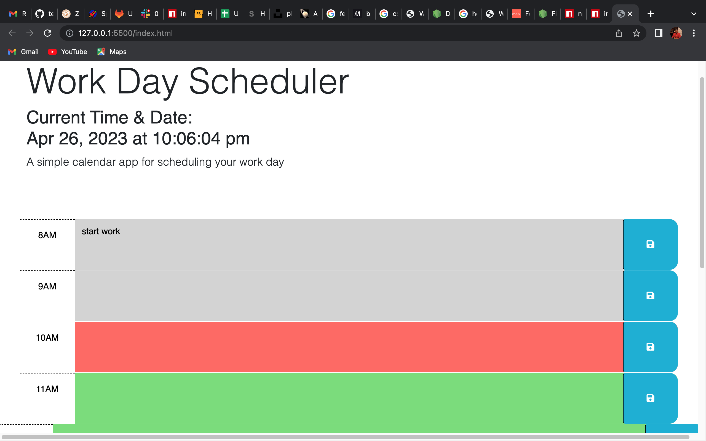

# work-calender

## Description

I was motivated to complete the project because I wanted a better calender to be able to stay on schedule with work deadlines. This calender keeps track of each day and time with enabling you to be able to save things you need to do during work hours.

## Table of Contents (Optional)

If your README is long, add a table of contents to make it easy for users to find what they need.

- [Installation](#installation)
- [Usage](#usage)
- [Credits](#credits)
- [License](#license)

## Installation

What are the steps required to install your project? Provide a step-by-step description of how to get the development environment running.

## Usage

Click the hour you wish to add notes. Add notes. Click blue save button on right side.

## Credits

Docs on Day.js https://day.js.org/docs/en/display/format

## License

MIT License

## Webpage

Link to webpage below

https://teewalk32.github.io/work-calender/
